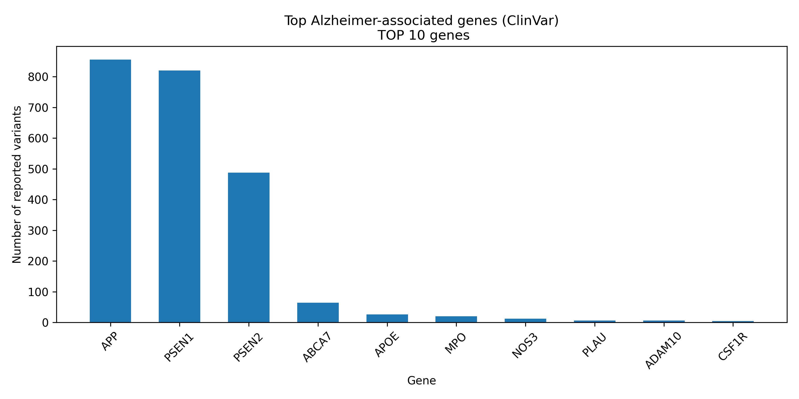
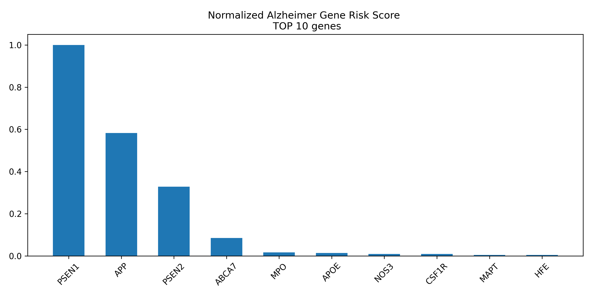

# Alzheimer genetic analysis
This project analyze Alzheimer-associated genetic variants from the ClinVar database

## Objectives
- Filter Alzheimer-related varinats
- Identify the most frequently affected genes
- Create weighted gene risk score
- Visualize results

## Data source
ClinVar variant_summary dataset from NCBI

## Tools
- Python
- pandas
- Matplotlib

## Results
The analysis identified APP, PSEN1 and PSEN2 as the most prominent genes in the Alzheimer subset

## Visualisation
- Top genes

- Weighted risk
  
- Weighted risk after normalization

